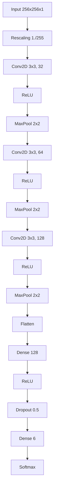

# CNN Architecture: WaferDefectNet

## Overview
WaferDefectNet is a custom Convolutional Neural Network implemented in TensorFlow/Keras, designed properly for the texture-rich, high-contrast nature of SEM images.

## Architecture Diagram

## Layer Specification
1. **Rescaling**: Normalizes input pixels to [0, 1].
2. **Conv Block 1**: 32 filters, 3x3 kernel, ReLU activation. Captures low-level edges.
3. **Conv Block 2**: 64 filters, 3x3 kernel, ReLU activation. Captures textures.
4. **Conv Block 3**: 128 filters, 3x3 kernel, ReLU activation. Captures complex shapes (vias, cracks).
5. **Dense Head**: 
   - Flatten 2D features to 1D vector.
   - Dense hidden layer (128 units).
   - Dropout (0.5) for regularization.
   - Output layer (6 units) with Softmax for probability distribution.
